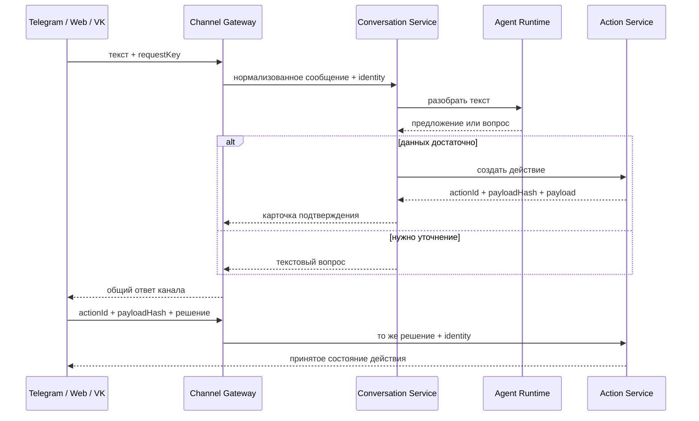

# ADR-0013: Conversation Service владеет диалогом

- Status: accepted
- Date: 2026-09-14

## Контекст

`Channel Gateway` уже принимает общий текстовый запрос и вызывает `Agent Runtime`. Следующий шаг —
создать сохранённое действие и вернуть карточку подтверждения. Если эту цепочку реализовать внутри
каждого канала или Gateway, Web, Telegram и VK начнут по-разному обрабатывать повторы, состояние
диалога и ошибки.

`Agent Runtime` не должен сохранять действие: он переводит текст в предложение. `Action Service`
не должен вести диалог: он хранит и выполняет уже сформированное действие.

## Решение

Создать отдельный `Conversation Service` как владельца прикладной оркестрации сообщения.

Границы компонентов:

- `Channel Gateway` проверяет identity, нормализует запрос и переводит общий ответ в протокол канала.
  Он остаётся stateless: сообщения передаёт Conversation Service, а команды виджета — Action Service.
  Прямой вызов Agent Runtime остаётся только на временном совместимом маршруте.
- `Conversation Service` хранит сообщения и состояние диалога, обеспечивает идемпотентность по
  `tenantId + subject + requestKey`, вызывает Agent и Action.
- `Agent Runtime` только возвращает предложение действия или вопрос для уточнения.
- `Action Service` остаётся источником истины для `actionId`, `payloadHash`, статуса и результата.
- `Widget SDK` проверяет и отображает общий контракт карточки. Он не вызывает Agent, MCP или базу.
- Кнопка карточки отправляет решение вместе с `actionId` и `payloadHash` в Channel Gateway. Gateway не
  меняет команду, а передаёт её в Action Service; только Action Service принимает или отклоняет действие.

Переход выполнен совместимо: `/api/v1/conversations/messages` обслуживает новые каналы, а существующий
`/api/v1/messages` остаётся временным техническим маршрутом. Решение виджета проходит через
`/api/v1/actions/{actionId}/decisions`. Старый маршрут удаляется только в следующей major-версии.

## Причина

Так один и тот же диалог работает во всех каналах, а границы остаются простыми: Gateway отвечает за
транспорт, Conversation — за ход диалога, Agent — за разбор текста, Action — за надёжное действие.
Повтор доставки из Telegram или VK не создаёт второе действие.

## Последствия

- Conversation Service работает в отдельном репозитории со своей базой и миграциями.
- Channel Gateway сохраняет прямой вызов Agent только для обратной совместимости.
- Контракт ответа канала должен различать текст, карточку подтверждения и результат.
- Карточка содержит только отображаемые данные и ссылку на сохранённое действие; секреты и правила
  выполнения в неё не попадают.
- Реальные бизнес-правила уточнений и текста карточки требуют отдельного решения владельца продукта.
