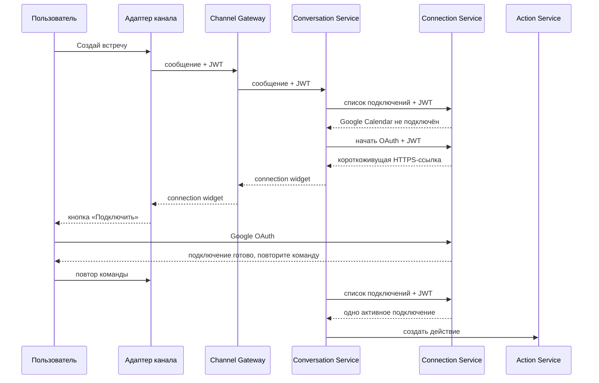

# ADR-0016: Каналы показывают общий виджет подключения

- Status: accepted
- Date: 2026-10-04

## Контекст

Пользователь может попросить создать встречу до подключения Google Calendar. Telegram Adapter не
должен знать правила Google OAuth. То же поведение должно работать в Web, VK, СберЧате и будущих
каналах.

Ссылка Google OAuth содержит одноразовый `state`. Если сохранить её как обычный ответ диалога, повтор
запроса может вернуть старую ссылку. Также секреты OAuth не должны попасть в БД Conversation Service,
логи, события или историю Temporal.

## Решение

Conversation Service проверяет активное подключение перед созданием действия с внешним connector.
Он передаёт исходный Bearer JWT в Connection Service и не принимает владельца подключения из JSON.

Если активного подключения нет:

1. Conversation Service сохраняет только безопасное намерение показать подключение: provider,
   заголовок и текст.
2. Перед HTTP-ответом Conversation Service запрашивает у Connection Service новую короткоживущую
   authorization URL.
3. В ответ добавляется общий `connection` widget из репозитория contracts.
4. Channel Gateway передаёт ответ без своих правил.
5. Адаптер канала отображает кнопку-ссылку доступным для канала способом.
6. После OAuth MVP просит повторить исходную команду. Автоматическое продолжение будет отдельным
   решением с callback-событием и надёжной маршрутизацией в канал.

## Состояние и повторы

- Conversation Service не сохраняет authorization URL, `state`, code или token.
- Идемпотентный повтор сообщения создаёт новую ссылку через Connection Service.
- Connection Service остаётся единственным владельцем OAuth state и PKCE verifier.
- Если найдено несколько подключений без default, сервис не выбирает одно молча. Выбор аккаунта будет
  отдельным виджетом и контрактом.
- Если Connection Service недоступен, действие не создаётся, а клиент получает контролируемую ошибку.

## Границы репозиториев

- `contracts` — тип ответа `connection` и JSON Schema общего виджета.
- `conversation-service` — проверка подключения и прикладное решение показать виджет.
- `connection-service` — OAuth, список подключений и короткоживущая ссылка.
- `channel-gateway` — проверка и передача ответа без выбора провайдера.
- `widget-sdk` — проверка общего формата, без HTTP и состояния.
- `telegram-adapter` — только Telegram-кнопка с URL.
- `deploy` и `test-lab` — конфигурация и fake OAuth acceptance без внешних секретов.

## Последствия

- подключение не привязано к Telegram;
- старую OAuth-ссылку нельзя случайно вернуть из БД;
- перед созданием действия появляется один внутренний HTTP-вызов;
- автоматическое продолжение команды пока отсутствует, зато MVP не вводит ненадёжную скрытую очередь;
- новый OAuth-провайдер добавляется через тот же тип виджета и новую provider strategy.
