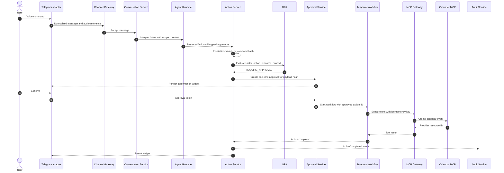

# Action execution

The sequence below is executable documentation: Mermaid renders it in pull requests and in the public
documentation portal.

The model is not called again after approval to regenerate tool arguments. Temporal receives the stored
action ID, and the executor verifies the payload hash before invoking the tool.

