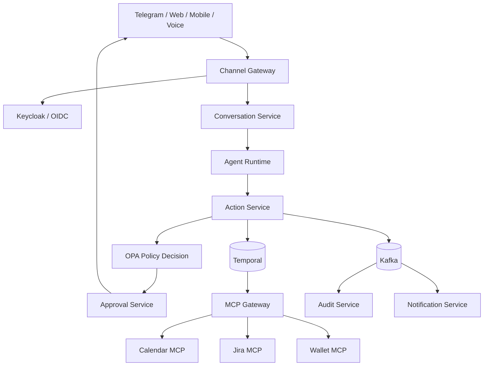

# Архитектура платформы

## Ландшафт системы

## Архитектурные инварианты

- Каждый stateful-сервис владеет своей базой данных и миграциями.
- Сервис никогда не читает базу другого сервиса напрямую.
- Каждая команда содержит `actionId`, `tenantId`, `correlationId` и `idempotencyKey`.
- Подтверждение привязано к хэшу неизменяемого action payload.
- Финансовая операция никогда не выполняется из свободного вывода модели.
- Temporal владеет durable command workflows; Kafka распространяет domain и integration events.
- События доставляются как минимум один раз, consumers идемпотентны.
- Transactional outbox согласует изменения локального состояния и публикацию событий.
- Контракты обратно совместимы в пределах major-версии и проверяются в CI.
- Все сервисы передают W3C Trace Context и отправляют данные OpenTelemetry.

## Границы репозиториев

Платформа использует polyrepo-модель. Каждый deployable-сервис, SDK, policy bundle и infrastructure control
plane находятся в отдельном репозитории. Платформа связывает их через совместимые с Backstage метаданные
каталога и версионируемые контракты; она никогда не собирает их вместе.
