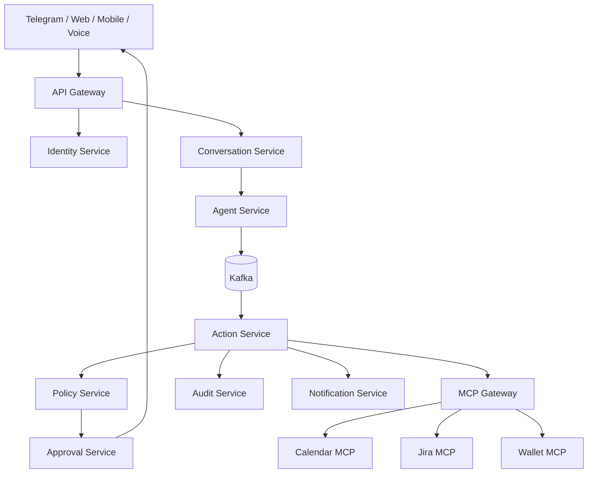

# Архитектура платформы

## Контуры

## Инварианты

- Каждый stateful-сервис владеет собственной базой и миграциями.
- Базы других сервисов никогда не читаются напрямую.
- Все команды имеют `actionId`, `tenantId`, `correlationId` и `idempotencyKey`.
- Подтверждение привязано к hash неизменяемого payload.
- Финансовое действие не исполняется из свободного LLM-ответа.
- События доставляются как минимум один раз; consumer обязан быть идемпотентным.
- Публикация событий выполняется через transactional outbox.
- Межсервисные контракты обратно совместимы в пределах major version.
- Все сервисы передают W3C Trace Context и публикуют OpenTelemetry telemetry.

## Технологический baseline

- Java 25 и Spring Boot 4 для доменных сервисов.
- TypeScript для Widget SDK и web-клиента.
- PostgreSQL на сервис, Redis только для временного состояния.
- Kafka для событий и Saga workflows.
- OpenAPI 3.1 и AsyncAPI для контрактов.
- Keycloak/OIDC для identity federation.
- Vault или cloud secret manager; секреты отсутствуют в Git и Kafka.
- Docker, Kubernetes, Helm, Argo CD и External Secrets Operator.
- OpenTelemetry, Prometheus, Grafana, Loki и Tempo.

Технология добавляется только вместе с эксплуатационным сценарием, владельцем и способом проверки.

