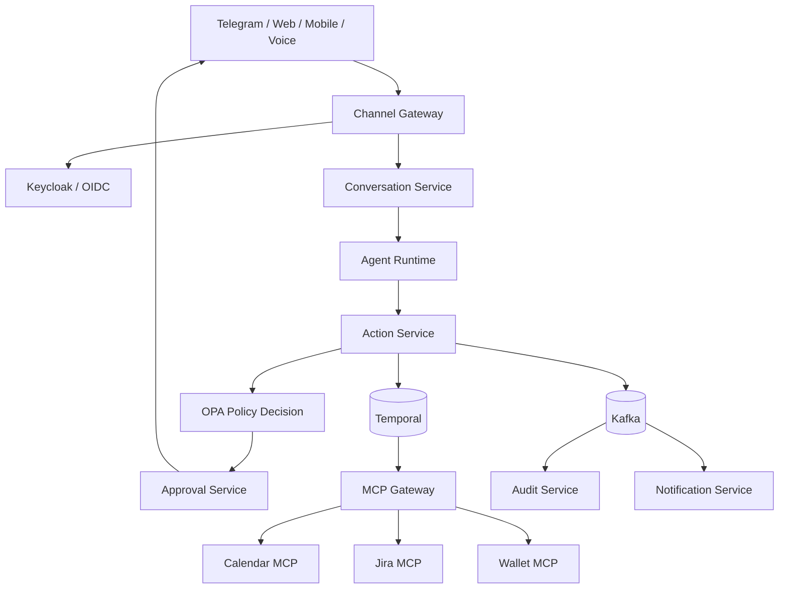

# Platform architecture

## System landscape

## Architectural invariants

- Every stateful service owns its database and migrations.
- A service never reads another service's database directly.
- Every command carries `actionId`, `tenantId`, `correlationId`, and `idempotencyKey`.
- Approval is bound to the hash of an immutable action payload.
- A financial operation is never executed from free-form model output.
- Temporal owns durable command workflows; Kafka distributes domain and integration events.
- Events are delivered at least once and consumers are idempotent.
- Transactional outbox keeps local state changes and event publication consistent.
- Contracts are backward compatible within a major version and validated in CI.
- All services propagate W3C Trace Context and emit OpenTelemetry data.

## Repository boundaries

The platform uses a polyrepo model. Each deployable service, SDK, policy bundle, and infrastructure control
plane has a separate repository. The platform repository links them through Backstage-compatible catalog
metadata and versioned contracts; it never compiles them together.

