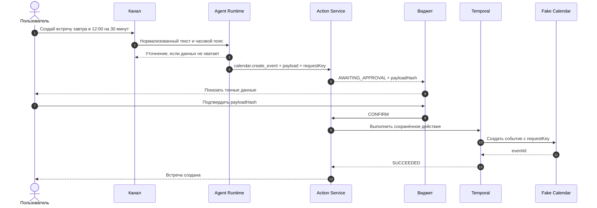
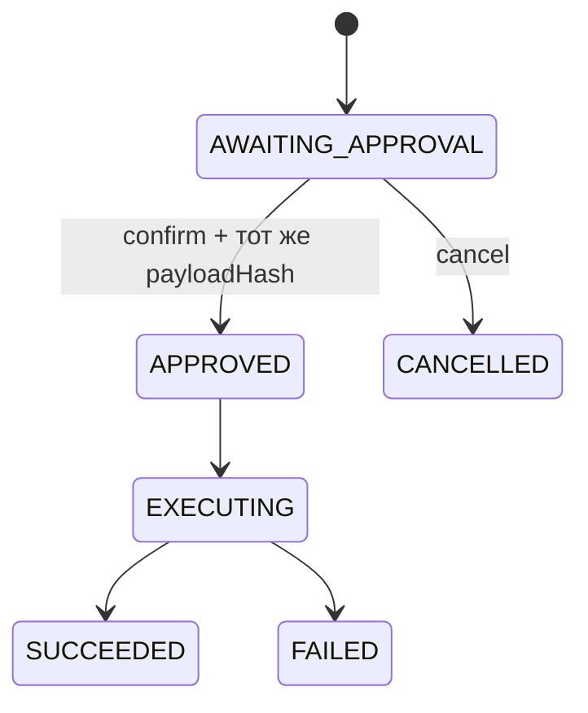

# MVP: создание встречи

Статус: правила подтверждены владельцем продукта.

## Результат для пользователя

Пользователь пишет или говорит просьбу создать встречу. Если данных достаточно, система показывает
карточку с точными аргументами. Встреча создаётся только после явного подтверждения.

Первый исполнитель — `fake-calendar`. Он позволяет проверить весь путь без внешнего аккаунта. Реальный
календарь позже подключается за тем же контрактом.

## Правила первой версии

- разрешено только действие `calendar.create_event`;
- создание всегда требует подтверждения;
- обязательны название, начало, конец и часовой пояс;
- описание и участники необязательны;
- если обязательных данных нет, агент задаёт уточняющий вопрос;
- повтор одного запроса не создаёт вторую встречу;
- конечные состояния: `SUCCEEDED`, `FAILED` и `CANCELLED`.

Участники являются персональными данными. Их адреса не попадают в обычные логи. В тестах используются
только адреса домена `.test`.

## Путь запроса

После показа карточки AI не изменяет payload. Workflow получает сохранённое действие, а не новый ответ
модели.

## Состояния

## Acceptance criteria

1. При полном запросе появляется карточка подтверждения с названием и временем.
2. Без часового пояса или времени создаётся уточнение, а не действие.
3. До подтверждения `fake-calendar` не вызывается.
4. При изменённом `payloadHash` подтверждение отклоняется.
5. Повтор с тем же `requestKey` возвращает прежнее действие.
6. Отмена переводит действие в `CANCELLED` и не вызывает календарь.
7. Успех возвращает стабильный `eventId`; ошибка коннектора переводит действие в `FAILED`.

## Не входит в первый инкремент

- Google OAuth и настоящий календарь;
- голосовое распознавание;
- изменение и удаление встреч;
- повторяющиеся события;
- платежи, Jira и другие действия.
